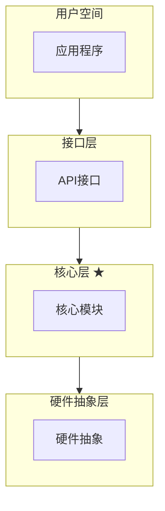
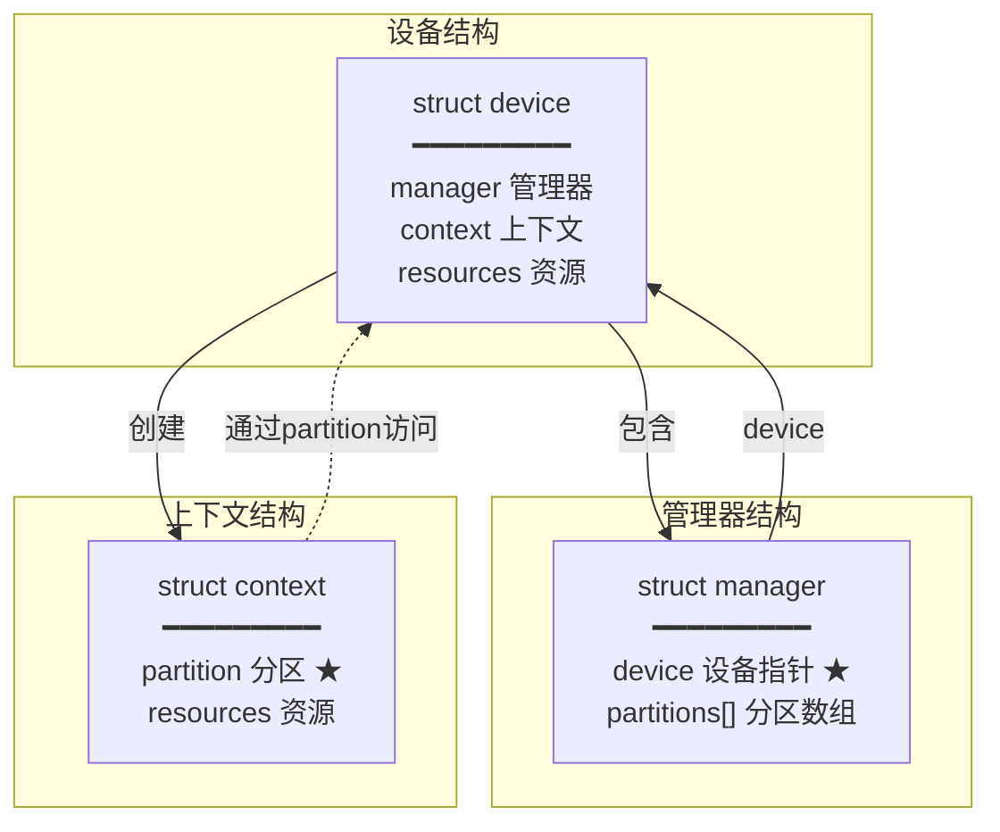
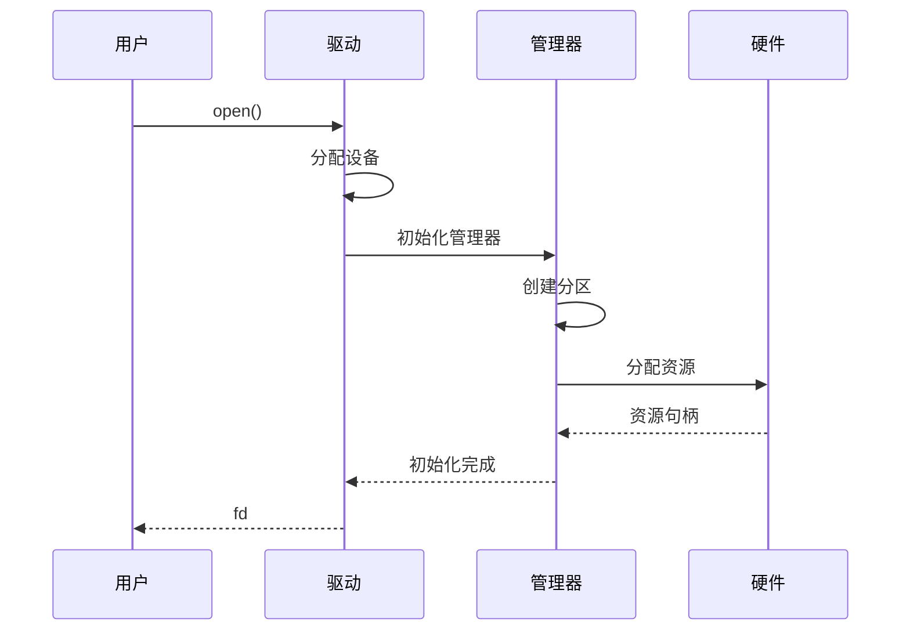
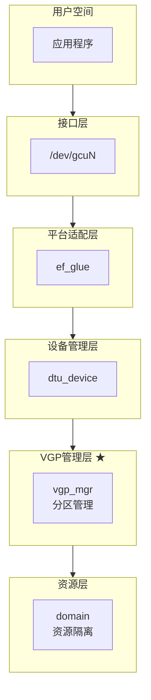
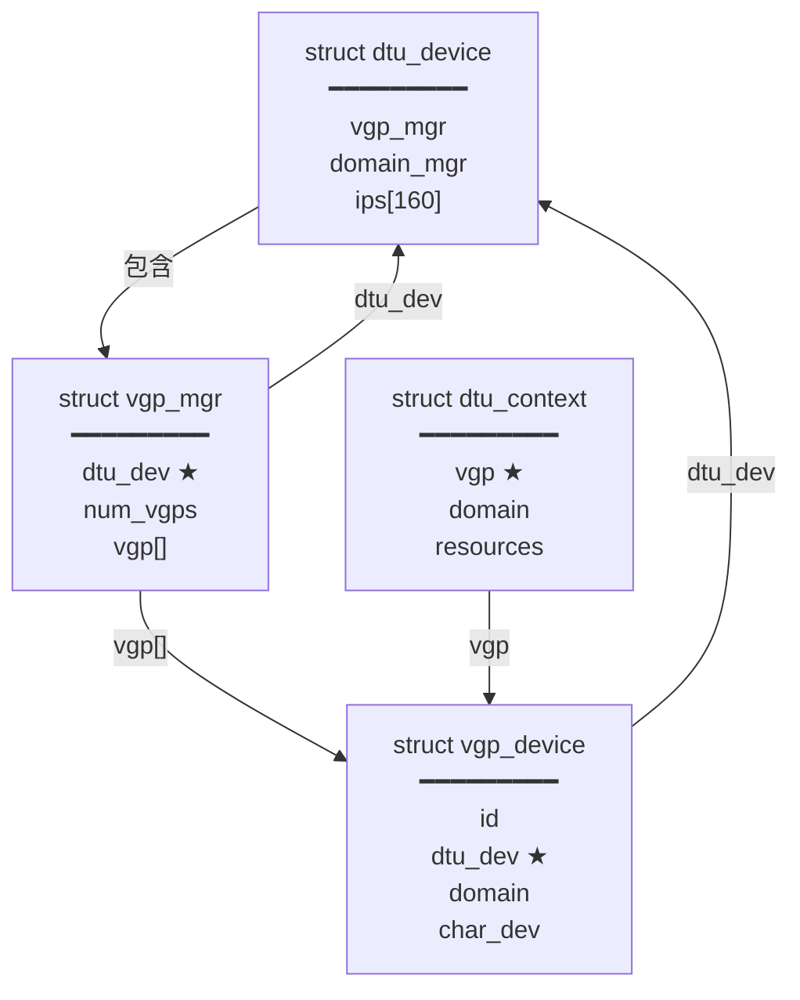
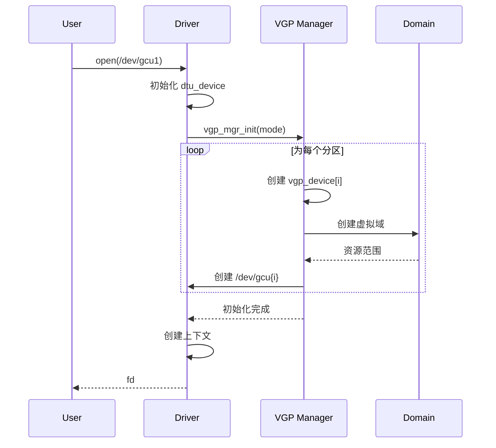

# Three-View Architecture Analysis

## 核心理念

三视图法是一种系统化的架构分析方法，通过三个互补的视角全面理解软件系统：

1. **层次架构图（Layered Architecture）** - 静态视图，展示软件分层和模块边界
2. **数据结构关系图（Structure Diagram）** - 数据视图，展示核心数据结构及其关系
3. **时序流程图（Sequence Diagram）** - 动态视图，展示初始化和执行流程

**为什么需要三个视角？**

- 单一视图难以完整表达复杂系统
- 静态结构（层次+数据）揭示设计，动态流程揭示行为
- 三视图互补验证，确保理解的完整性和一致性

## 视图一：层次架构图

### 目标

理解软件分层结构、模块边界和接口定义。

### 分析方法

1. **识别分层**：自顶向下识别各层（用户空间、内核空间、硬件抽象等）
2. **标注组件**：在每层标注关键组件和模块
3. **明确接口**：标注层间的接口和依赖方向
4. **突出重点**：用颜色或标记突出核心层和关键组件

### Mermaid格式

使用 `flowchart TD` 纵向堆叠展示层次关系：

### 关键要点

- 清晰的层次边界和职责划分
- 依赖方向（避免反向依赖）
- 跨层的关键交互路径
- 使用 `★` 标记核心层或重点组件

## 视图二：数据结构关系图

### 目标

理解核心数据结构、所有权关系和访问路径。

### 分析方法

1. **识别核心结构**：找出系统中最关键的 struct/class
2. **梳理关系**：识别包含、引用、依赖关系
3. **标注字段**：列出关键字段和所有权信息
4. **访问路径**：展示如何从一个结构访问另一个

### Mermaid格式

使用 `flowchart` 展示结构关系：

### 关键要点

- 所有权关系（包含、引用）
- 生命周期（谁创建谁销毁）
- 双向关联的处理
- 访问路径的效率

## 视图三：时序流程图

### 目标

理解系统的动态行为、初始化顺序和关键操作流程。

### 分析方法

1. **选择关键流程**：初始化、资源分配、请求处理等1-2个核心流程
2. **识别参与者**：参与该流程的模块或组件
3. **追踪调用**：按时间顺序追踪函数调用
4. **标注状态**：标注关键的状态变化和资源流动

### Mermaid格式

使用 `sequenceDiagram` 展示时序：

### 关键要点

- 清晰的时间顺序
- 关键的状态变化点
- 资源的创建和流动
- 错误处理路径（可选）

## 标准分析工作流

### 步骤1：快速探索（5-10分钟）

**目标**：获取代码库全局认知

**操作**：
- 使用 explore agent 快速浏览代码库结构
- 识别主要目录和模块
- 查找关键头文件和入口函数
- 识别核心数据结构定义文件

### 步骤2：绘制层次图（15-20分钟）

**目标**：建立静态架构认知

**操作**：
- 从用户态到硬件，自顶向下识别分层
- 在每层中识别2-5个关键组件
- 标注层间的主要接口
- 使用颜色区分不同层次

**产出**：纵向堆叠的层次架构图

### 步骤3：梳理结构图（15-20分钟）

**目标**：理解数据结构设计

**操作**：
- 找出3-5个最核心的数据结构
- 绘制结构之间的包含和引用关系
- 标注关键字段（不是全部字段）
- 标注所有权和访问路径

**产出**：数据结构关系图

### 步骤4：追踪流程图（10-15分钟）

**目标**：理解动态行为

**操作**：
- 选择1个最关键的流程（通常是初始化）
- 识别3-6个参与者
- 按时间顺序追踪关键函数调用
- 标注重要的状态变化

**产出**：时序流程图

### 步骤5：验证和优化（5-10分钟）

**操作**：
- 向用户展示三张图
- 根据反馈调整细节
- 简化过于复杂的部分
- 确保图表互相印证

## 设计原则

### 1. 渐进式细化

先画粗粒度框架，再逐步添加细节。不要一开始就陷入细节。

### 2. 突出重点

- 使用 `★` 标记核心组件
- 使用颜色区分不同类别（通过 `style` 或 `classDef`）
- 用粗线或粗体标注关键路径

### 3. 保持简洁

- 一张图聚焦一个主题
- 每层/模块不超过5-7个组件
- 关键字段不超过5-7个
- 时序图参与者不超过6个

### 4. 对比学习

如果有成熟的参考架构（如AMD、NVIDIA、Linux内核），可以：
- 并排对比相似的概念
- 学习成熟的设计模式
- 识别差异和改进点

## 图表生成策略

### 默认行为

当用户说"用三视图法分析XXX系统"而没有指定具体图表时，**生成完整的三张图**：
1. 层次架构图
2. 数据结构关系图
3. 时序流程图

这提供了最全面的系统理解。

### 用户指定行为

当用户明确指定图表类型时，只生成指定的图：

- "用三视图法生成**架构图**" → 只生成层次架构图
- "用三视图法生成**结构图**" → 只生成数据结构关系图
- "用三视图法生成**流程图**"或"**时序图**" → 只生成时序流程图
- "用三视图法生成**架构图和流程图**" → 生成指定的两张

### 灵活性

关键是分析思维方法，而非固定的图表数量。根据系统复杂度和用户需求灵活调整。

## 示例：驱动架构分析

以下是一个简化的驱动架构分析示例：

### 用户请求

"用三视图法分析这个GPU驱动的VGP（虚拟GPU分区）架构"

### 分析过程

**第一步：快速探索** - 识别到关键目录和结构
- `kmd/` - 内核驱动
- `runtime/` - 用户态运行时
- 核心结构：`dtu_device`, `vgp_mgr`, `dtu_context`

**第二步：层次架构图** - 绘制6层架构

**第三步：数据结构关系图** - 展示核心结构关系

**第四步：时序流程图** - 展示初始化流程

### 输出总结

三张图从不同角度揭示了VGP架构：
- **层次图**：展示了VGP在6层架构中的核心位置
- **结构图**：展示了`vgp_mgr`和`vgp_device`的设计，以及与物理设备的关系
- **流程图**：展示了VGP初始化时如何创建多个虚拟分区

## 最佳实践总结

1. **先整体后局部**：先理解整体架构，再深入细节
2. **多视角验证**：三个视图应该互相印证，不矛盾
3. **适度抽象**：保持合适的抽象层次，避免过度细节
4. **迭代优化**：根据用户反馈持续优化图表
5. **灵活应用**：根据实际需求选择视图，不必强求三张

## 何时使用部分视图

- **只需架构图**：快速了解系统分层时
- **只需结构图**：理解数据模型和对象关系时
- **只需流程图**：理解特定操作流程时
- **架构图+结构图**：关注静态设计，不关心动态行为时
- **架构图+流程图**：快速理解系统，不深入数据结构时

关键是根据用户明确的需求和系统的复杂度灵活调整。
